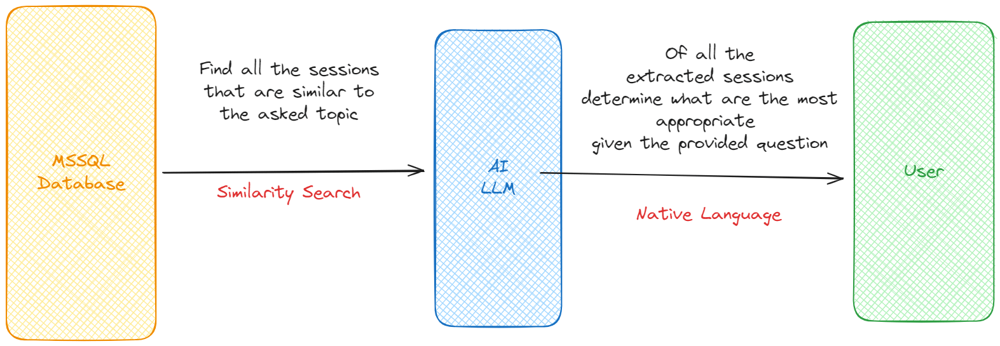
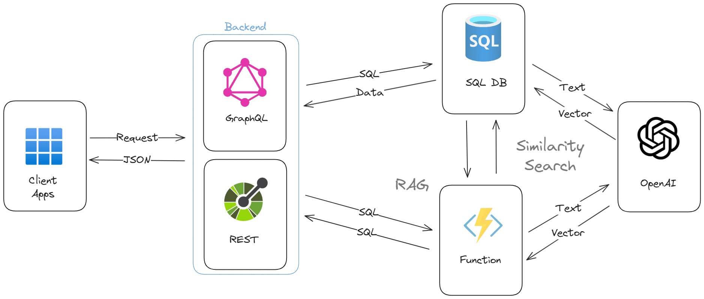
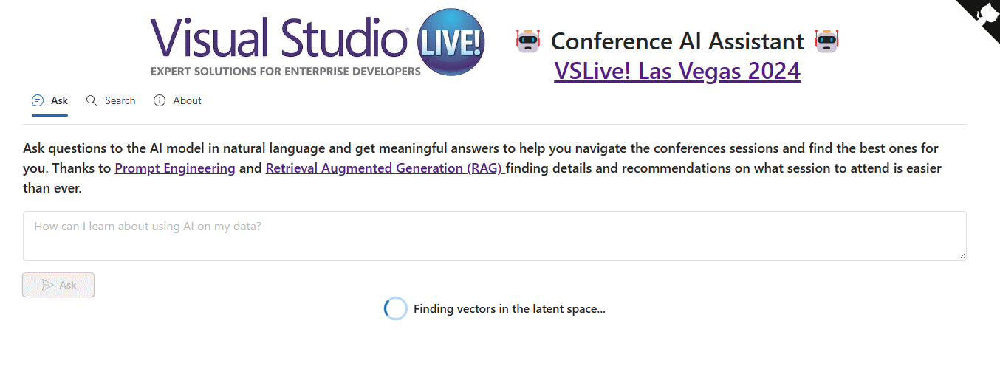

# Session Assistant Sample - Retrieval Augmented Generation with Azure SQL DB and OpenAI

This sample demonstrates how to build a session recommender using Jamstack and Event-Driven architecture, using Azure SQL DB to store and search vectors embeddings generated using OpenAI. The solution is built using Azure Static Web Apps, Azure Functions, Azure SQL Database, and Azure OpenAI.

A fully working, production ready, version of this sample, that has been used at [VS Live](https://vslive.com/) conferences, is available here: https://ai.lasvegas.vslive.com/



This repository is a evoution of the [Session Recommender](https://github.com/azure-samples/azure-sql-db-session-recommender) sample. In addition to vector search, also Retrieval Augmented Generation (RAG) is used to generate the response to the user query. If you are completely new to this topic, you may want to start there, and then come back here.



A session recommender built using

- [Azure Static Web Apps](https://learn.microsoft.com/en-us/azure/static-web-apps/overview)
- [Azure OpenAI](https://learn.microsoft.com/azure/ai-services/openai/)
- [Azure Functions](https://learn.microsoft.com/azure/azure-functions/functions-overview?pivots=programming-language-csharp)
- [Azure Functions SQL Trigger Binding](https://learn.microsoft.com/azure/azure-functions/functions-bindings-azure-sql-trigger)
- [Azure SQL Database](https://www.sqlservercentral.com/articles/the-sql-developer-experience-beyond-rdbms)
- [Data API builder](https://aka.ms/dab)

For more details on the solution check also the following articles:

- [How I built a session recommender in 1 hour using Open AI](https://dev.to/azure/how-i-built-a-session-recommender-in-1-hour-using-open-ai-5419)
- [Vector Similarity Search with Azure SQL database and OpenAI](https://devblogs.microsoft.com/azure-sql/vector-similarity-search-with-azure-sql-database-and-openai/)

# Deploy the sample using the Azure Developer CLI (azd) template

The Azure Developer CLI (`azd`) is a developer-centric command-line interface (CLI) tool for creating Azure applications.

## Prerequisites

- Install [AZD CLI](https://learn.microsoft.com/azure/developer/azure-developer-cli/install-azd).
- Install [.NET SDK](https://dotnet.microsoft.com/download).
- Install [Node.js](https://nodejs.org/download/).
- Install [SWA CLI](https://azure.github.io/static-web-apps-cli/docs/use/install#installing-the-cli).

## Install AZD CLI

You need to install it before running and deploying with the Azure Developer CLI.

### Windows

```powershell
powershell -ex AllSigned -c "Invoke-RestMethod 'https://aka.ms/install-azd.ps1' | Invoke-Expression"
```

### Linux/MacOS

```bash
curl -fsSL https://aka.ms/install-azd.sh | bash
```

After logging in with the following command, you will be able to use azd cli to quickly provision and deploy the application.

## Authenticate with Azure

Make sure AZD CLI can access Azure resources. You can use the following command to log in to Azure:

```bash
azd auth login
```

## Initialize the template

Then, execute the `azd init` command to initialize the environment (You do not need to run this command if you already have the code or have opened this in a Codespace or DevContainer).

```bash
azd init -t Azure-Samples/azure-sql-db-session-recommender-v2
```

Enter an environment name.

## Deploy the sample

Run `azd up` to provision all the resources to Azure and deploy the code to those resources.

```bash
azd up 
```

Select your desired `subscription` and `location`. Then choose a resource group or create a new resource group. Wait a moment for the resource deployment to complete, click the Website endpoint and you will see the web app page.

**Note**: Make sure to pick a region where all services are available like, for example, *West Europe* or *East US 2*

## GitHub Actions

Using the Azure Developer CLI, you can setup your pipelines, monitor your application, test and debug locally.

```bash
azd pipeline config
```

## Test the solution

Add a new row to the `Sessions` table using the following SQL statement (you can use tools like [Azure Data Studio](https://learn.microsoft.com/en-us/azure-data-studio/quickstart-sql-database) or [SQL Server Management Studio](https://learn.microsoft.com/en-us/azure/azure-sql/database/connect-query-ssms?view=azuresql) to connect to the database. No need to install them if you don't want. In that case you can use the [SQL Editor in the Azure Portal](https://learn.microsoft.com/en-us/azure/azure-sql/database/connect-query-portal?view=azuresql)):

```sql
insert into web.sessions 
    (title, abstract, external_id, start_time_PST, end_time_PST, require_embeddings_update)
values
    (
        'Building a session recommender using OpenAI and Azure SQL', 
        'In this fun and demo-driven session you’ll learn how to integrate Azure SQL with OpenAI to generate text embeddings, store them in the database, index them and calculate cosine distance to build a session recommender. And once that is done, you’ll publish it as a REST and GraphQL API to be consumed by a modern JavaScript frontend. Sounds pretty cool, uh? Well, it is!',
        'S1',
        '2024-03-10 10:00:00',
        '2024-03-10 11:00:00',
        1
    )
```

immediately the deployed Azure Function will get executed in response to the `INSERT` statement. The Azure Function will call the OpenAI service to generate the text embedding for the session title and abstract, and then store the embedding in the database, specifically in the `web.sessions_embeddings` table.

```sql
select * from web.sessions_embeddings
```

You can now open the URL associated with the created Static Web App to see the session recommender in action. You can get the URL from the Static Web App overview page in the Azure portal.



## Run the solution locally

The whole solution can be executed locally, using [Static Web App CLI](https://github.com/Azure/static-web-apps-cli) and [Azure Function CLI](https://learn.microsoft.com/en-us/azure/azure-functions/functions-run-local?tabs=windows%2Cisolated-process%2Cnode-v4%2Cpython-v2%2Chttp-trigger%2Ccontainer-apps&pivots=programming-language-csharp).

Install the required node packages needed by the fronted:

```bash
cd client
npm install
```

once finished, create a `./func/local.settings.json` and `.env` starting from provided samples files, and fill out the settings using the correct values for your environment.

From the sample root folder run:

```bash
swa start 
```

and once the local Static Web App environment is running, you can connect to

```text
http://localhost:4280/
```

and test the solution locally.

## Fluent UI

The solution uses Fluent UI for the UI components. The Fluent UI is a collection of UX frameworks from Microsoft that provides a consistent design language for web, mobile, and desktop applications. More details about Fluent UI can be found at the following links: 

- https://github.com/microsoft/fluentui
- https://react.fluentui.dev/ 

## Credits

Thanks a lot to [Aaron Powell](https://www.aaron-powell.com/) for having helped in building the RAG sample, doing a complete UI revamp using the Fluent UI and for the implementaiton of the `ask` endpoint.
